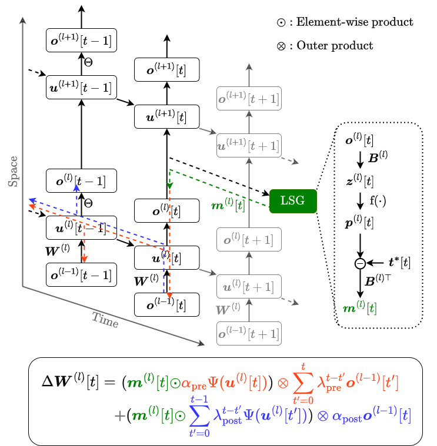

# TESS: A Scalable Temporally and Spatially Local Learning Rule for Spiking Neural Networks

This repository is the official implementation of TESS, a scalable temporally and spatially local learning rule for spiking neural networks (SNNs), and replicates the experimental results obtained on the CIFAR10, CIFAR100, IBM DVS Gesture, and CIFAR10-DVS datasets. Its primary purpose is to aid in understanding the methodology and reproduce essential results. This work has been accepted for publication in Proceedings of the International Joint Conference on Neural Networks (IJCNN) 2025.

[[ArXiv Paper]](https://arxiv.org/abs/2502.01837) [[IJCNN Paper]](https://doi.org/10.1109/IJCNN64981.2025.11227652)

## Abstract
The demand for low-power inference and training of deep neural networks (DNNs) on edge devices has intensified the need for algorithms that are both scalable and energy-efficient. While spiking neural networks (SNNs) allow for efficient inference by processing complex spatio-temporal dynamics in an event-driven fashion, training them on resource-constrained devices remains challenging due to the high computational and memory demands of conventional error backpropagation (BP)-based approaches. In this work, we draw inspiration from biological mechanisms such as eligibility traces, spike-timing-dependent plasticity, and neural activity synchronization to introduce TESS, a temporally and spatially local learning rule for training SNNs. Our approach addresses both temporal and spatial credit assignments by relying solely on locally available signals within each neuron, thereby allowing computational and memory overheads to scale linearly with the number of neurons, independently of the number of time steps. Despite relying on local mechanisms, we demonstrate performance comparable to the backpropagation through time (BPTT) algorithm, within $\sim1.4$ accuracy points on challenging computer vision scenarios relevant at the edge, such as the IBM DVS Gesture dataset, CIFAR10-DVS, and temporal versions of CIFAR10, and CIFAR100. Being able to produce comparable performance to BPTT while keeping low time and memory complexity, TESS enables efficient and scalable on-device learning at the edge.

<p align = "center">

</p>
<p align = "center">
Figure 1: Overview of TESS. The diagram illustrates an SNN model unrolled in time, where $u^{(l)}[t]$ denotes the membrane potential of neurons in the $l$-th layer at time step $t$, and $o^{(l)}[t]$ represents the corresponding output spikes. Signals involved in weight update computation are highlighted: red represents the eligibility trace based on causal relationships between inputs and outputs, blue represents the eligibility trace for non-causal relationships, and green represents the local learning signal $m^{(l)}[t]$ used to modulate the eligibility traces. The local learning signal is generated independently for each layer through a learning signal generation (LSG) process. The fixed binary matrix $B^{(l)}$ used in the LSG process features columns corresponding to square wave functions. While, $f(\cdot)$ is a softmax function, and $t^*[t]$ represent the labels..
</p>

## How to Use

1. Install the required dependencies listed in `requirements.txt`. 
2. Use the following command to run an experiment:

    ```shell
    python main.py --param-name param_value
    ```

    A description of each parameter is provided in `main.py`.

## Reproducing Results in the Paper

To ensure reproducibility, we have provided a bash script (`./script.sh`) with the commands used to obtain the results reported in the paper.

## Citation

If you use this code in your research, please cite our paper:

```bibtex
@INPROCEEDINGS{11227652,
  author={Apolinario, Marco P. E. and Roy, Kaushik and Frenkel, Charlotte},
  booktitle={2025 International Joint Conference on Neural Networks (IJCNN)}, 
  title={TESS: A Scalable Temporally and Spatially Local Learning Rule for Spiking Neural Networks}, 
  year={2025},
  pages={1-9},
  doi={10.1109/IJCNN64981.2025.11227652}}

```
